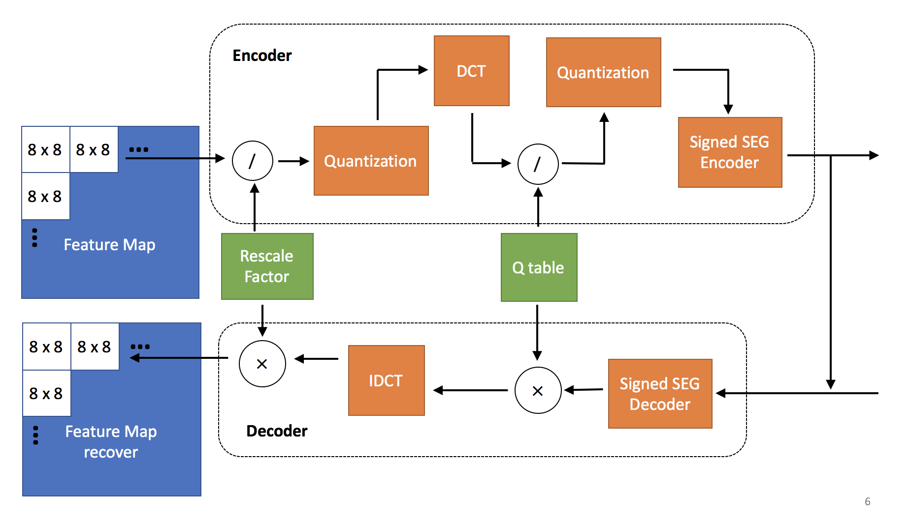
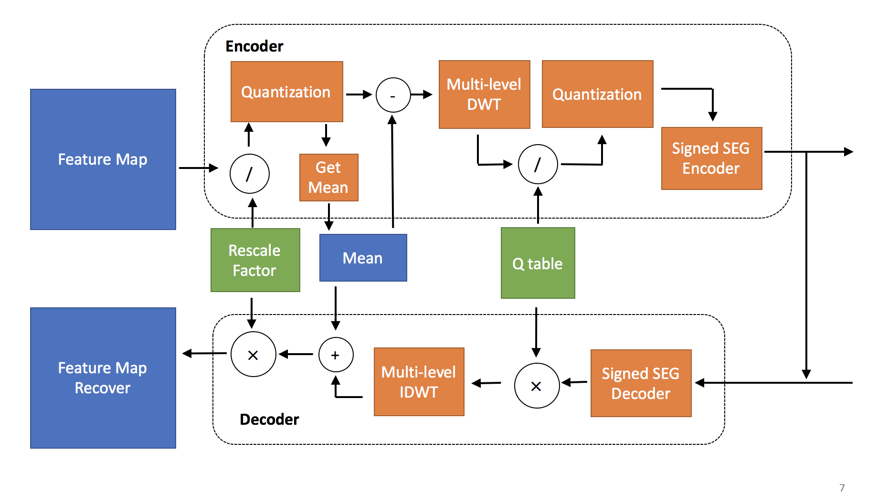

## 環境

* certifi==2018.8.24
* cffi==1.11.5
* cycler==0.10.0
* kiwisolver==1.0.1
* matplotlib==3.0.2
* mkl-fft==1.0.6
* mkl-random==1.0.1
* numpy==1.15.2
* olefile==0.46
* Pillow==5.2.0
* pycparser==2.18
* pyparsing==2.3.1
* python-dateutil==2.8.0
* pytz==2018.9
* PyWavelets==1.0.3
* six==1.11.0
* torch==0.4.1.post2
* torchvision==0.2.1
* tornado==5.1.1
* tqdm==4.28.1

## 檔案說明
### functional

DCT及DWT的implementation。

### model

定義了各種東西要怎麼forward

#### ResNet.py
##### ResNetCifar

1. conv2d: kernel=3, inChannel=3, outChannel=16
2. batchNorm2d: numFeatures=16
3. ReLU
4. 疊一層ResNetStages，壓縮在這裡發生啦！
5. AvgPool2d: kernel=8
6. 展開來攤平
7. 過Linear: inFeature=64(目前都用BasicBlock所以block.expansion都是1), outFeature=10(現在寫死適用Cifar10)

##### ResNetStages

* 1, 2, 3包起來疊len(ns)個
* 第三點的變數blocks是ns的element

1. 一個ResNetBlock
2. Downsample
    * stride != 1 或 expansion != 1 : conv2d -> batchNorm2d
    * otherwise : None
3. 疊blocks個ResNetBlock

* 會在每一個block做完後存一次feature map

##### ResNetBlock

1. 一個指定block(一路從ResNetCifar傳下來的，目前寫死是BasicBlock)
2. 上一層的output加上identity
    * downsample == None的話identity就是剛剛BasicBlock的input(ResNetStage call ResNetBlock的時候都沒給downsample)
    * otherwise, identity = downsample(x)
3. ReLU

##### BasicBlock

1. conv2d: kernel=3
2. batchNorm2d
3. ReLU
4. conv2d: kernel=3
5. batchNorm2d:

#### compress.py
##### CompressDCT

##### CompressDWT

### infer.py

根據指定model用dct/dwt壓縮後log model parameters size。

1. 設定model參數、壓縮
2. 用給定的exponential-Golomb常數k跑跑
3. 令k=1~5印壓縮率比較比較

### infer_result_handler.py

各種量化結果(Mean, Accuracy, Feature Map, Quantization)的工具。

### retrain.py

* 跟賈哥拿資料gogogo
* epoch_start沒有功能

1. 從utils拿dataloader
2. 從models拿要用的model，傳參數
3. log params size
4. 壓縮
5. optimizer用SDG；criterion用crossEntropy；scheduler用MultiStepLR
8. 開始train，forward接著backward後紀錄loss, prec1, prec5
9. 對每個epoch：
    * 印當前#epoch跟learning rate
    * 丟進train()
    * train夠久後(超過epochs_test)開始要丟進infer測
    * 拿top1 acc，還要檢查他是不是目前train過程中最好的
    * 印當前top1 acc跟歷史最好的acc

### train.py

* 基本跟retrain一樣
* model寫死，適用ResNetCifar
* epoch_start=0可以觸發training的warm_up

### utils.py

infer&train共用的一些function